# Project：Bunny Market

## Background Overview
This project is a small-scale online second-hand trading platform for students at the Oakland campus of Northeastern University. It aims to facilitate the transfer of personal idle items within the campus. Students can either open and manage their own stores or act as consumers to purchase second-hand items from others.

## Implementation
The website is based on a multi-seller structure, allowing different sellers to manage their own data independently. A collaborative filtering recommendation algorithm is integrated for personalized recommendations, enabling tailored suggestions for users. The recommendation process leverages asynchronous multi-threading to efficiently handle data from different users.

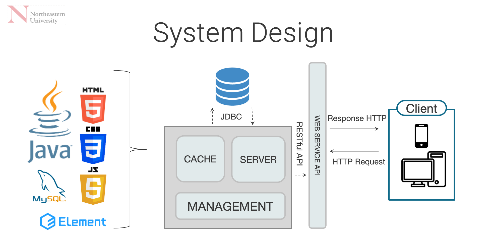
## Key Features by Role

### Administrator
- Login, Personal Dashboard, Change Password
- Verify student registration information; once approved, merchants can publish product information
- Manage admin information, merchant information, and user data
- Manage product categories and product information across the platform
- Manage orders across different merchants
- Manage reviews on products from different merchants
- Publish system-wide announcements

| Manage Admin | Manage Sellers | Manage Buyers|
|-------|-------|-------|
|  | 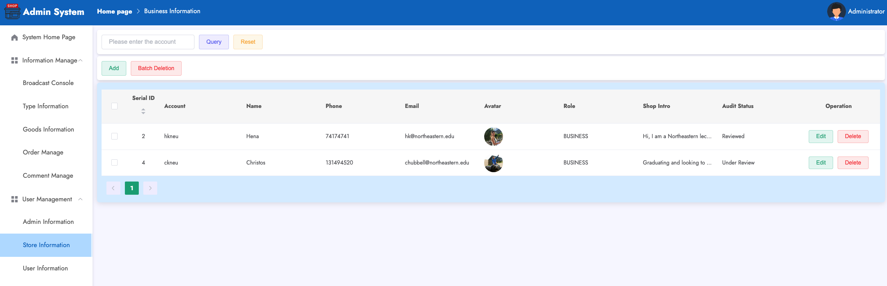 | 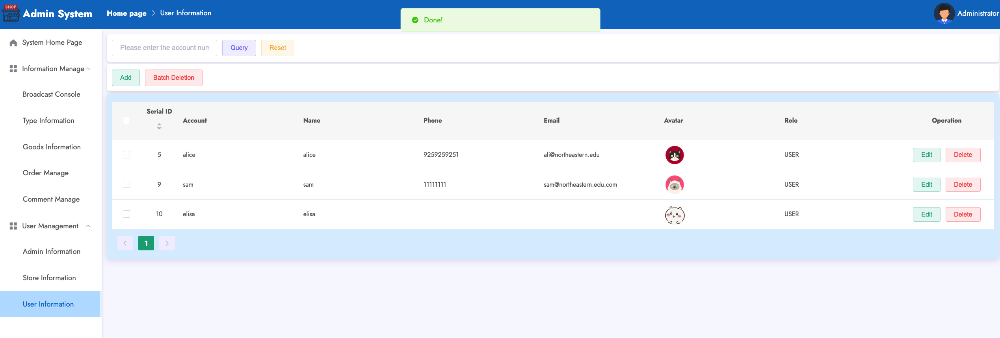 |

| Manage Notification | Manage Product Categories |
|-------|-------|
| 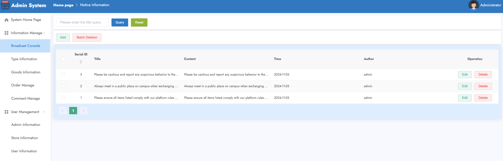 | 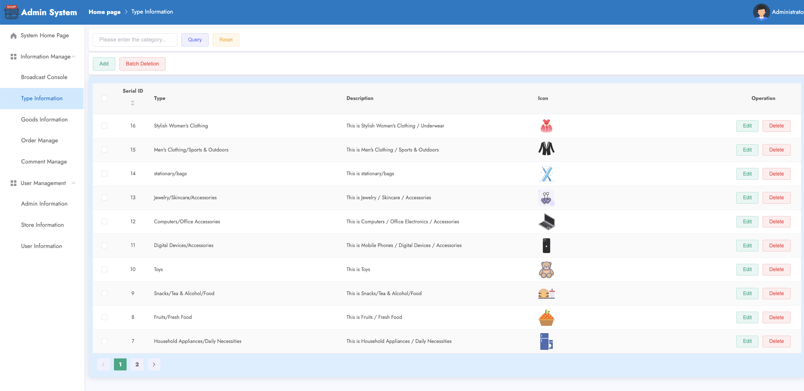 | 

| Manage Order | Manage Comments |Manage Products |
|-------|-------|-------|
| 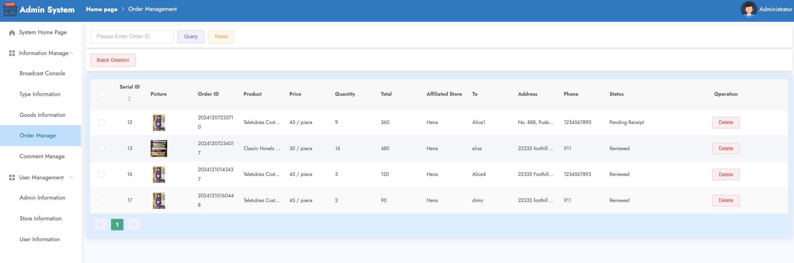 | 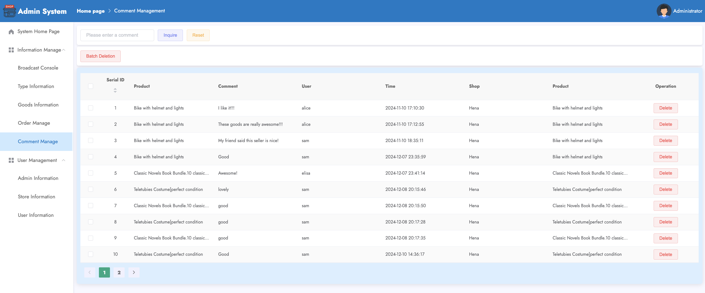 |  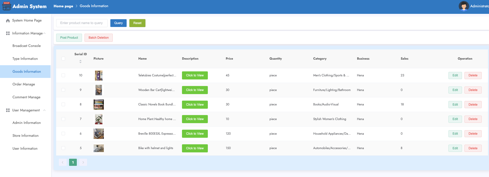 | 


### Business: Student Seller
- Register, Login, Personal Dashboard, Change Password
- Publish product information
- Manage orders within their store
- Manage users and reviews within their store

| Seller Console | Selller : Order Track | Seller : Order Management |
|-------|-------|-------|
|  |  |  |


### User: Student Buyer
- Register, Login, Personal Dashboard, Change Password
- Browse all products on the platform, including search and category-based browsing
- View recommended products, powered by a collaborative filtering algorithm
- Save items of interest to a wishlist
- View product details, reviews, add products to the cart, and place orders
- Leave reviews for purchased products after completing an order
- Maintain shipping address information
- View their orders and track the status of placed orders

| Register | Login | Change Password|
|-------|-------|-------|
| 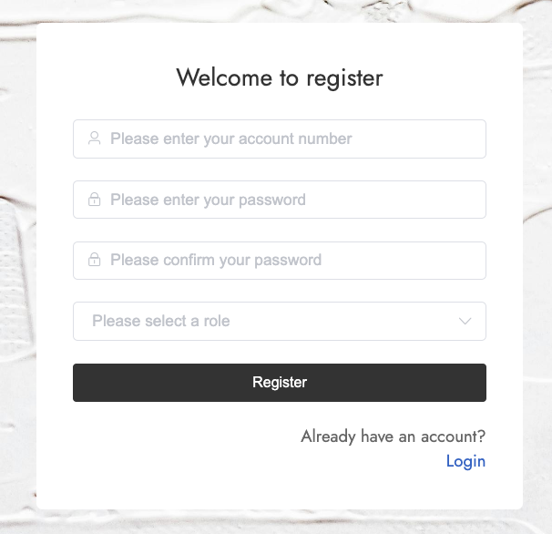 | 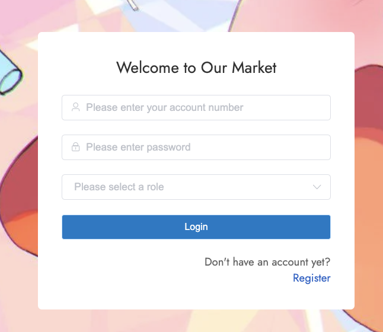 | 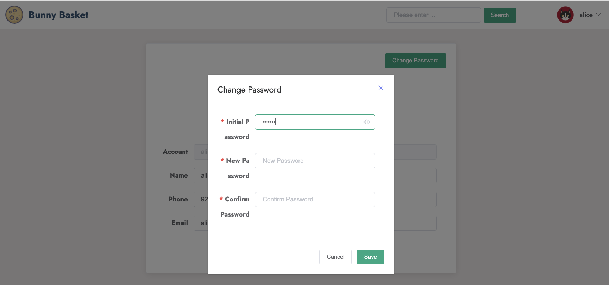 |

| Comments | View Products | Favourites|
|-------|-------|-------|
| 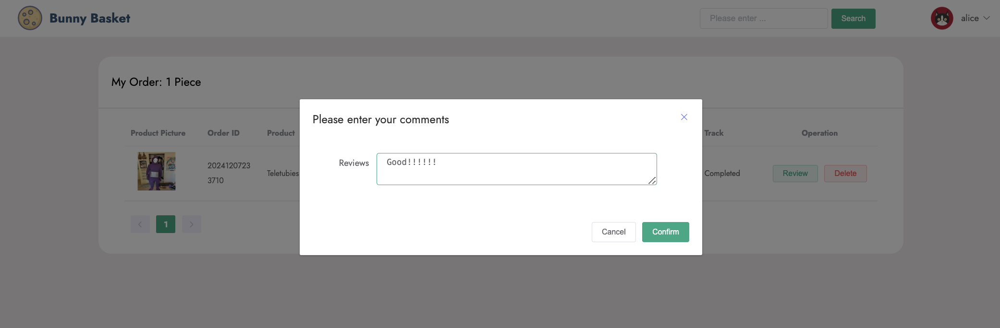 | 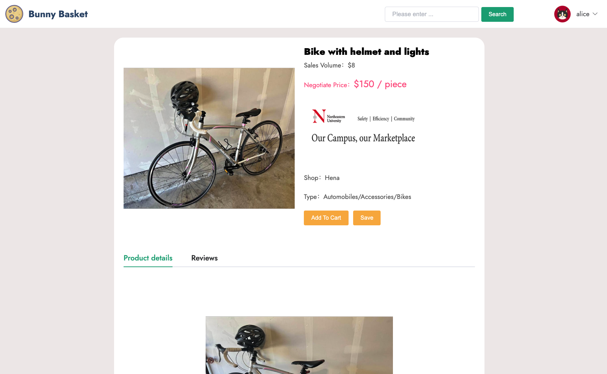 | 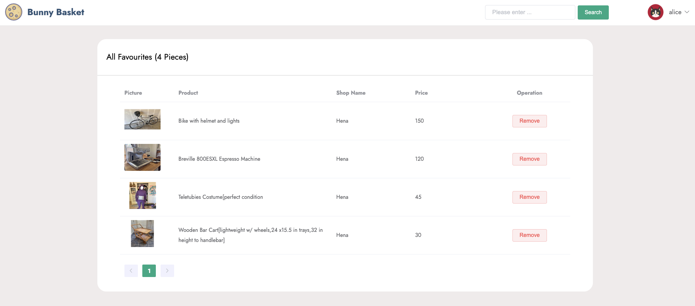 |

---
## GoodsService Documentation
The <code>GoodsService</code> class provides business logic for managing goods in the system. It interacts with various mappers to perform CRUD operations and includes additional functionality such as pagination and user-specific recommendations.

This service is built using Spring Framework and leverages external libraries like <code>cn.hutool</code>, <code>PageHelper</code>, and custom utility classes.

### Core Modules and Design Concepts

#### 1. Dependency Injection and Responsibility Separation

- Dependency Injection: The <code>@Resource</code> annotation is used to inject multiple mappers, such as GoodsMapper and UserMapper, to interact with the database.

- Responsibility Separation:

1. Each mapper focuses on handling data operations for a specific entity.

2. GoodsService is responsible for invoking mappers and encapsulating business logic.

#### 2. Multithreading and Asynchronous Processing

The recommendation feature uses ExecutorService for thread pooling and CountDownLatch to coordinate thread completion. This ensures efficient parallel computation.
- Thread Pool: Executors.newCachedThreadPool() dynamically allocates thread resources to avoid performance bottlenecks.

- Latch Mechanism: CountDownLatch ensures that all user-product relationship data calculations are completed before executing the recommendation algorithm.

#### 3. Recommendation Algorithm Design

Collaborative Filtering:
- There are certain collaborative correlations between different users and items. By calculating these correlations, we can identify the one or more items with the 
highest relevance and recommend them to specific users.

Two Approaches to Collaborative Filtering:
1. User-Based Recommendation:
- User A likes products 1, 2, and 3; User B likes products 2, 3, 4, and 5; User C likes products 5, 6, and 7. When User B refreshes their page, the recommendation system identifies a higher correlation between Users A and B. It will recommend items that the other user interacted with, excluding those they both already engaged with.
2. Item-Based Recommendation:
- Based on item features such as category, audience, color, etc., when a user interacts with a specific item (e.g., likes, saves, or purchases it), the system analyzes the item's feature data. It then pushes one or more items with the highest feature similarity to the user.

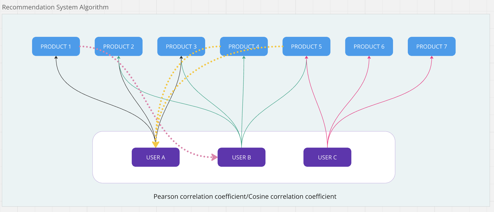

The recommendation feature combines user behavior (e.g., favorites, cart additions, orders, and comments) with a collaborative filtering algorithm (UserCF).

- Behavior Weights:

1. Favorite: Weight 1

2. Add to Cart: Weight 2

3. Order: Weight 3

4. Comment: Weight 2

These behaviors are abstracted into a RelatedAlgo relationship table, which is fed into the collaborative filtering algorithm for recommendations.


**Example**:

User A and User B both showed behavioral correlations after browsing costume props. However, instead of repeatedly recommending the same product, the recommendation system suggested the coffee machine added to User A's cart to User B, and the plant added to User B's cart to User A.

| User A's Behaviour | User A's Behaviour| 
|-------|-------|
| 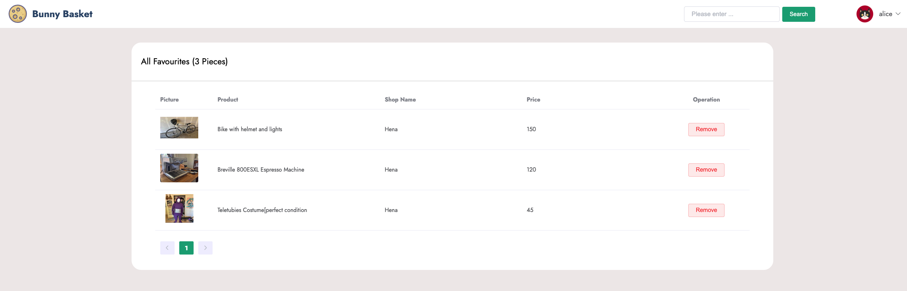 |  | 

| User B : Recommendation | User B : Recommendation  |
|-------|-------|
| 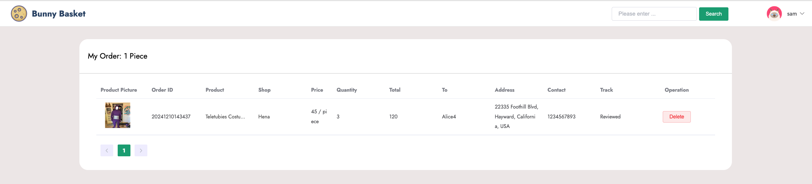 | |

**Limitations**:
1. **Cold Start Problem**: For new users or new products, the system may perform poorly due to insufficient behavioral data to establish correlations.
2. **Lack of Context Awareness**: The system may not consider contextual factors like time, location, or user mood, resulting in recommendations that do not match the user’s immediate needs or circumstances.

**Areas for Improvement**:
1. **Enhancing User Feedback Mechanisms**: Collect feedback on recommended items (e.g., click-through rates, conversions) to iteratively adjust and optimize the recommendation model.
2. **Integrating Content-Based Recommendations**: Combine collaborative filtering with content-based methods by analyzing product descriptions or images to complement behavioral insights.

#### 4. Recommendation Feature

**Method:** public List<Goods> recommend()

Principle:

Data Preparation: Extract user-product behavior data from favorites, cart, orders, and comments tables.

Weight Calculation: Use multithreading to calculate weights for each user-product pair.

Collaborative Filtering: Use UserCF.recommend to compute recommendations.
```
for (Goods goods : allGoods) {
            Integer goodsId = goods.getId();
            for (User user : allUsers) {
                threadPool.execute(() -> {
                    Integer userId = user.getId();
                    int index = 1;

                    if (allCollects.stream().anyMatch(x -> x.getGoodsId().equals(goodsId) && x.getUserId().equals(userId))) {
                        index += 1;
                    }
                    if (allCarts.stream().anyMatch(x -> x.getGoodsId().equals(goodsId) && x.getUserId().equals(userId))) {
                        index += 2;
                    }
                    if (allOrders.stream().anyMatch(x -> x.getGoodsId().equals(goodsId) && x.getUserId().equals(userId))) {
                        index += 3;
                    }
                    if (allComments.stream().anyMatch(x -> x.getGoodsId().equals(goodsId) && x.getUserId().equals(userId))) {
                        index += 2;
                    }

                    if (index > 1) {
                        data.add(new RelatedAlgo(userId, goodsId, index));
                    }
                    countDownLatch.countDown();
                });
            }
        }
```

```
List<Goods> goods = goodsMapper.selectAll(null);
for (int i = 0; i < num; i++) {
    int index = new Random().nextInt(goods.size());
    list.add(goods.get(index));
}
return list;
```
#### 5. Optimization Suggestions

1. Recommendation Algorithm Optimization

- Current weight calculation is simple; consider introducing more dimensions (e.g., browsing history, time-based weights).

- Use more efficient collaborative filtering implementations.

2. Multithreading Optimization

- Use a fixed-size thread pool (Executors.newFixedThreadPool) to limit resource consumption.

3. Caching Mechanism

- Cache popular recommendation results using tools like Redis to reduce redundant computations.

4. Code Modularization

- Extract weight calculation logic into an independent utility class to improve code reusability.


## Requirements
- **Backend**: Java 17+, Spring Boot
- **Frontend**: Node.js 16+, Vue, Element UI
- **Database**: MySQL(JDBC)
- **Tools**: Maven, npm


## Run
- **Start the Spring Boot Backend**：run the document of SpringbootApplication
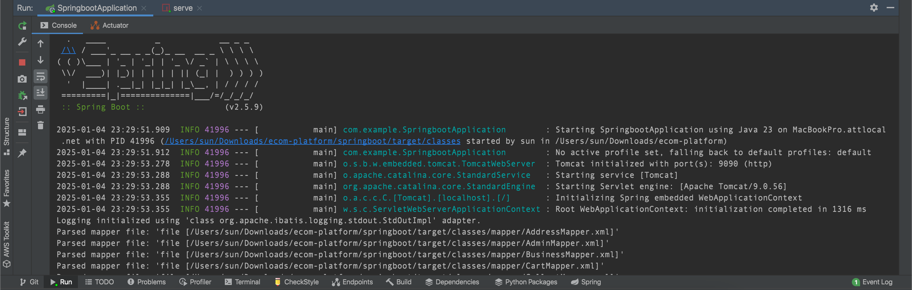
- **Start the Vue Frontend**:
1.Navigate to the frontend directory:
```
cd vue
``` 
2.Install dependencies:
```
npm install
``` 
3. Start the development server:
```
npm run serve
``` 
Then:
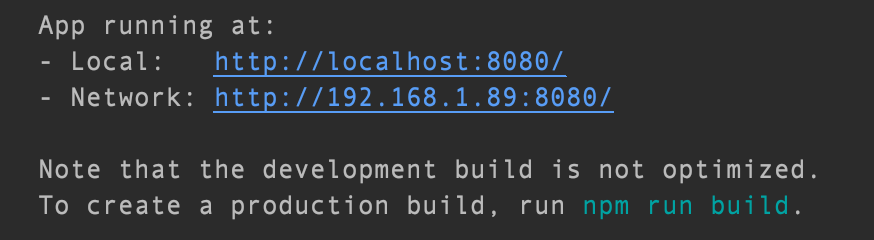